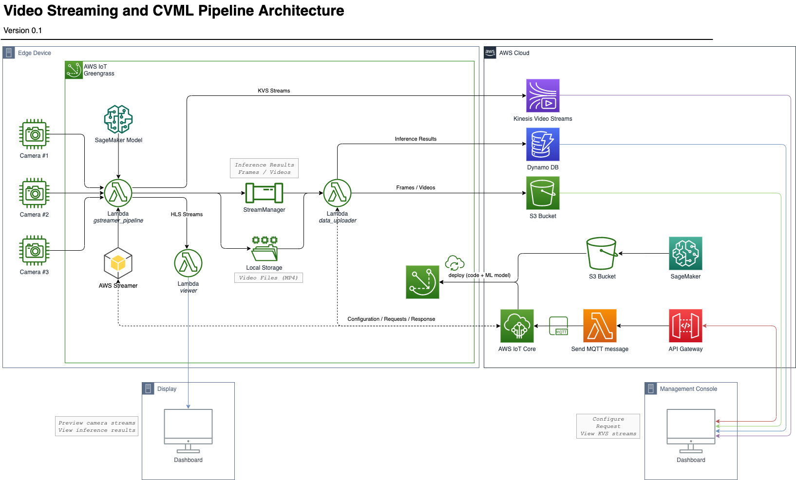

# Greengrass Setup

This greengrass group contains the following lambdas:

 - [GStreamer Pipeline](src/gstreamer_pipeline/README.md)
 - [Data Uploader](src/data_uploader/README.md)

For more details about the internal configuration, read [this](src/README.md)

For information on how to use them from user's perspective, click on each lambda name above.

## Architecture



## Install Greengrass

Download the version of the [Greengrass Core software](https://docs.aws.amazon.com/greengrass/latest/developerguide/what-is-gg.html#gg-core-download-tab) you want to install to the edge device, and unzip it to `/`

For example:
```
wget https://d1onfpft10uf5o.cloudfront.net/greengrass-core/downloads/1.10.1/greengrass-linux-aarch64-1.10.1.tar.gz
sudo tar -xzvf greengrass-linux-aarch64-1.10.1.tar.gz -C /
```

Also, download the CA certificate you need for Greengrass:
```
wget https://www.amazontrust.com/repository/AmazonRootCA1.pem -O /greengrass/certs/root.ca.pem
```

## Runtime Dependencies

The commands below should only be executed on the target platform:

-  Follow AWS Streamer installation instructions

- Install needed python packages for all users:
    ```
    sudo su
    cd ~
    curl "https://bootstrap.pypa.io/get-pip.py" -o "get-pip.py"
    python3 get-pip.py --user
    pip3 install -r /path/to/this/folder/src/requirements.txt
    ```

- Make sure that video volume exists and is accesible by ggc_user:
    ```
    sudo mkdir /video
    sudo chgrp ggc_group /video
    sudo chown ggc_user /video
    ```

## Deployment Dependencies

These commands can be executed on any device with AWS account access.

- Install AWS CLI:
    ```
    curl "https://awscli.amazonaws.com/awscli-exe-linux-x86_64.zip" -o "awscliv2.zip"
    unzip awscliv2.zip
    sudo ./aws/install
    ```

- Install jq:

    Linux:
    ```
    sudo apt-get install jq
    ```
    MacOS:
    ```
    brew install jq
    ```

- Install SAM CLI by folling the instructions [here](https://docs.aws.amazon.com/serverless-application-model/latest/developerguide/serverless-sam-cli-install.html). No need to install Docker, you can skip that part.

- Create an S3 bucket:
    ```
    aws s3 mb s3://[BUCKET-NAME]
    ```
    That bucket will be used for temporary SAM files.

## Deployment

1. Publish lambda functions (typically executed from the edge device to make sure that compiled elements are included):
    ```
    tools/publish_lambda_all.sh [optional:AWS-PROFILE-NAME] [optional:REGION] [optional:AWS-ROLE]
    ```
    E.g.:
    ```
    tools/publish_lambda_all.sh
    ```

    Make sure that ```src/gstreamer_pipeline/``` has ```greengrasssdk/``` and ```lib/``` subdirectories in it beforehand.

2. Deploy the CloudFormation stack:
    ```
    ./deploy_stack.sh [BUCKET-NAME] [STACK-NAME] [optional:AWS-PROFILE-NAME]
    ```
    E.g.:
    ```
    ./deploy_stack.sh my-bucket-gg Streamer-GG-Stack
    ```

    After successfull deployment, you should see a new bucket in S3 named {STACK_NAME}-greengrassconfigsbucket-{HASH}.
    Take a note of its name, let's call it GREENGRASS_CONFIG_BUCKET.

3. SSH to your edge device and (assuming that you have AWS CLI configured there) execute this script:
    ```
    tools/get_device_certs.sh [GREENGRASS_CONFIG_BUCKET]
    ```
    E.g.:
    ```
    tools/get_device_certs.sh streamer-gg-stack-greengrassconfigsbucket-174402ulfr7ms
    ```

4. Deploy your greengrass group from the AWS Console UI or the command line:
    ```
    ./deploy_group.sh [BUCKET-NAME] [STACK-NAME] [optional:AWS-PROFILE-NAME]
    ```
    E.g.:
    ```
    ./deploy_group.sh my-bucket-gg Streamer-GG-Stack default
    ```

    NOTE: First time deployment from command line might fail due to 'TES service role is not associated with this account.' I'm working on fixing it. For now, just go to the AWS Console, deploy greengrass group from there and grant permissions when asked.

You're good to go. Check how to configure and use lambdas: [GStreamer Pipeline](src/gstreamer_pipeline/README.md) and [Data Uploader](src/data_uploader/README.md).

## Debugging

To debug the deployment process, check the log:
```
tools/log.sh runtime
```

For each particular lambda, check the log this way:
```
sudo tools/log.sh [LAMBDA-NAME]
```
E.g.:
```
sudo tools/log.sh GStreamer
sudo tools/log.sh DataUploader
```

## Local Development

The deploy code locally for a quick development (make sure to update versions manually):
```
tools/deploy_local_all.sh
```
