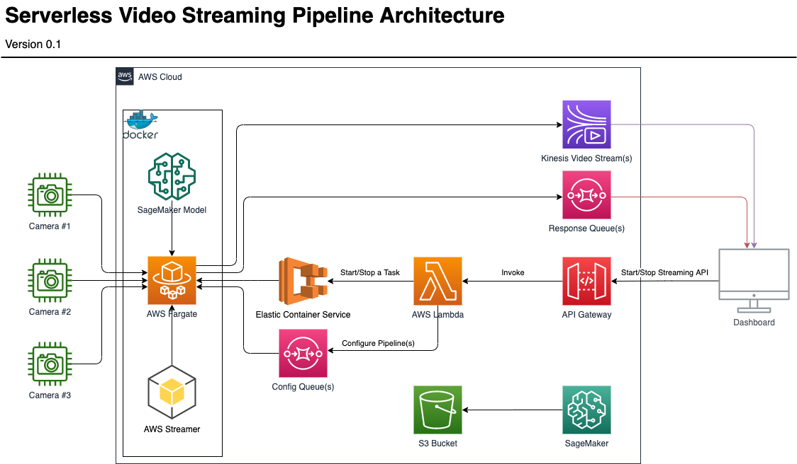

## AWS Streamer serverless demo

This repository contains resources for building a demo application that allows using AWS Streamer in the cloud, controlled by Gateway API. Included is a Docker image and serverless AWS CloudFormation templates that you can deploy to your AWS Account. The Walkthrough will show you how to create a container using the Docker image and upload it to Amazon Elastic Container Registry (ECR), which is referenced by a Amazon Elastic Container Service (ECS) task. AWS CloudFormation templates orchestrate resources (including Amazon APIGateway, Amazon Lambda, and Amazon ECS) that run the streaming demo application. When deployed, the startStreaming API will start a new pipeline with a configuration given in a body of the message. The stopStreaming API will stop the ECS task and complete the upload (if any).

## Architecture



## Prerequisites

For this walkthrough, you should have the following prerequisites:

* [An AWS account](https://signin.aws.amazon.com/signin?redirect_uri=https%3A%2F%2Fportal.aws.amazon.com%2Fbilling%2Fsignup%2Fresume&client_id=signup)
* Log into your AWS account with an IAM role that has the **AdministratorAccess** policy.

## Walkthrough

The sections as enumerated below will walk you through the process of creating and recording a Chime SDK meeting:

* Setup AWS Cloud9 environment and clone the demo application
* Create an Amazon Elastic Container Registry (ECR) and register a Docker container image
* Deploy the AWS Streamer video streaming template
* Start the streaming
* Stop the streaming

### Create an AWS Cloud9 environment

**Note**: Use the same AWS Region to create your Cloud9 environment where you want to deploy the recording application.

1. Log into the AWS console with your AWS credentials and go to the [AWS Cloud9 Console](https://us-east-1.console.aws.amazon.com/cloud9/home?region=us-east-1). **Note**: This link is for `us-east-1` region.
2. If you have previously set up a AWS Cloud9 environment in your account you can use it and skip this step entirely.
3. Press the **Create environment** button or go [here](https://us-east-1.console.aws.amazon.com/cloud9/home/create).
4. For the Name enter <unique environment name> and press the **Next step** button.
5. For **Environment Settings**
    * For **Instance Type**, select `Other instance type` and select `t3.medium` from the dropdown.
    * For **Platform**, select `Ubuntu Server 18.04 LTS`
    * Press the **Next step** button.
6. Review the **Environment name and settings** and press the **Create environment** button.
    You can optionally use your own Amazon EC2 instance if you have configured.
7. Wait for the environment to start.

### Create a Amazon ECR repository, build and push the docker image to Amazon ECR
1. In the AWS Cloud9 instance, run the below command to create a repository in Amazon ECR
    ```
    aws ecr create-repository --repository-name <repository-name>
    ```
    You will get a response similar to this
    ```
    {
        "repository": {
            "repositoryArn": "arn:aws:ecr:us-east-1:123456789012:repository/kvs-streaming-demo",
            "registryId": "123456789012",
            "repositoryName": "kvs-streaming-demo",
            "repositoryUri": "123456789012.dkr.ecr.us-east-1.amazonaws.com/kvs-streaming-demo",
            "createdAt": 1585247726.0,
            "imageTagMutability": "MUTABLE",
            "imageScanningConfiguration": {
                "scanOnPush": false
            }
        }
    }
    ```

2. Execute the following command with the value of `repositoryUri` from step 1 to build and push the docker image to Amazon ECR
    ```
    make ECR_REPO_URI=<repositoryUri>
    ```
    Once the above commands execute successfully you will see an entry for the image in Amazon ECR as follows:

    **Note:** If this command fails due to AWS CLI version 2.0 not available, you can follow the instructions given here: [Installing the AWS CLI version 2 on Linux](https://docs.aws.amazon.com/cli/latest/userguide/install-cliv2-linux.html) and try again.

### Deploy an AWS Streamer Video Streaming AWS CloudFormation Template

1. Execute the following command to create a AWS CloudFormation stack containing an Amazon ECS cluster, Amazon ECS task definition, Amazon S3 bucket, Amazon Lambda and an Amazon API Gateway deployment along with IAM roles and networking resources required for the Amazon ECS Cluster including an Amazon VPC, subnets, security groups, and an auto-scaling group.
    ```
    node ./deploy.js -b <my-bucket> -s <my-stack> -i <my-docker-image-uri> -r <region>
    ```

   Here is an example:
    ```
    node ./deploy.js -b cctv-streaming-cnf-deploy-bucket -s cctv-streaming-cnf-stack -i 978676124023.dkr.ecr.us-west-2.amazonaws.com/kvs-streaming:latest -r us-west-2
    ```
The above step deploys a AWS CloudFormation stack that creates resources needed to run the streaming service. It may take several minutes to complete. You will get an Amazon API Gateway invoke URL in the output.

E.g.:
```
Streaming API Gateway invoke URL: https://dwx0872tsd.execute-api.us-west-2.amazonaws.com/Prod/streaming
```

### Start the streaming

There are multiple ways for [invoking a REST API in Amazon API Gateway](https://docs.aws.amazon.com/apigateway/latest/developerguide/how-to-call-api.html). In this example we will [use the Postman app](https://docs.aws.amazon.com/apigateway/latest/developerguide/how-to-use-postman-to-call-api.html).

1. Follow the steps highlighted in this document to install the [Postman app](https://docs.aws.amazon.com/apigateway/latest/developerguide/how-to-use-postman-to-call-api.html).

    You need to select “AWS Signature” and add your `AccessKey`, `SecretKey` & `AWS Region` in the Authorization tab.

2. Start streaming by passing the `streamingAction` as "start" for our demo application as query parameters in the POST request to API Gateway. The body of the message should be set to raw/JSON and contain streaming pipeline configuration (see [examples](../configs/))

    Example configuration:
    ```JSON
    {
        "camera_0_kvs": {
            "enabled": true,
            "pipeline": "video",
            "source": {
                "name": "videotestsrc",
                "is-live": true,
                "do-timestamp": true,
                "width": 640,
                "height": 480,
                "fps": 30
            },
            "sink": {
                "name": "kvssink",
                "stream-name": "TestStreamECS"
            },
            "debug": true
        }
    }
    ```

    At this point the pipeline will create a Kinesis Video Streams stream called `TestStreamECS` and start ingesting video feed into it.

    Example POST request:
    ```
    https://tt06i48nd3.execute-api.us-west-2.amazonaws.com/Prod/streaming?streamingAction=start
    ```

### Stop the streaming

1. To stop the streaming, we need to pass the task ARN as `taskId` that was received in the API response to start the streaming in addition to the `streamingAction` denoting "stop".

    Example POST request:
    ```
    https://dwx0872tsd.execute-api.us-west-2.amazonaws.com/Prod/streaming?streamingAction=stop&taskId=arn:aws:ecs:us-west-2:978676124023:task/604742e6-f453-4ed6-a726-3c094a54cfd5
    ```
